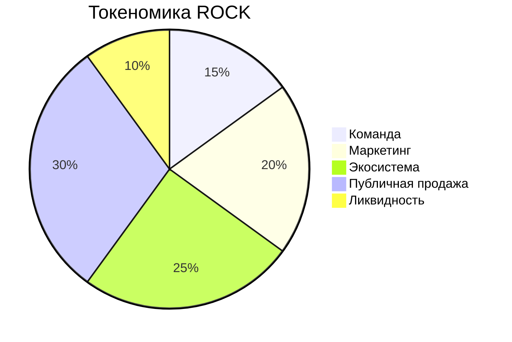

<canvas id="bitcoinChart" width="600" height="400"></canvas>

# 🎸 RockCOIN (ROCK)

Революционная криптовалюта для рок-музыки и музыкальной индустрии
# RockCOIN Website

Веб-сайт для криптовалюты RockCOIN с интерактивными графиками и информацией о проекте.

## 📊 Графики в проекте

В проекте используются два основных графика:
- График продаж битов
- График цены RockCOIN

### Как использовать графики

#######

## 📊 Статистика RockCOIN

График появится после появления криптовалюты...

## 📈 Продажи битов

График появится после появления криптовалюты...

## 🚀 О проекте

RockCOIN (ROCK) — революционная криптовалюта для поддержки рок-музыки. Наша платформа соединяет музыкантов и фанатов через блокчейн.
При помощи этого коина вы можете покупать биты и так же продовать их на этом же сайте за эту же криптовалюту. 
(Рынок бужет доступен в скором времени)

### Ключевые особенности:
- 💎 Прозрачная экономика
- 🎵 Продажа битов
- 🤝 Прямая поддержка артистов
- 🌟 Эксклюзивный контент

### Токеномика:
- Общее предложение: 100M ROCK
- Публичная продажа: 30%
- Команда: 15%
- Маркетинг: 20%
- Экосистема: 25%
- Ликвидность: 10%

## 📈 Статистика роста

| Месяц | Активные пользователи | Объем торгов | Цена ROCK |
|-------|----------------------|--------------|-----------|
| Январь | 5,000 | $1.5M | $10.50 |
| Февраль | 7,500 | $2.0M | $11.25 |
| Март | 9,000 | $2.2M | $11.75 |
| Апрель | 10,000+ | $2.5M | $12.50 |

## 💎 Ключевые показатели

- Общее предложение: 100M ROCK
- Активных пользователей: 10K+
- Проданных битов: 50K+

## 🔄 Распределение токенов

## 💫 О проекте

RockCOIN (ROCK) — революционная криптовалюта, созданная для поддержки и развития рок-музыки. 
Наша миссия — создать децентрализованную экосистему, где музыканты и фанаты могут взаимодействовать напрямую.

## 🎯 Наша миссия

- Создание справедливой системы монетизации для музыкантов
- Прямое взаимодействие артистов с фанатами
- Развитие инновационной музыкальной экосистемы
- Поддержка начинающих рок-музыкантов

## 🔒 Технические характеристики

- Тип токена: ERC-20
- Блокчейн: Ethereum
- Механизм консенсуса: Proof of Stake (PoS)
- Годовая доходность стейкинга: до 12% APY

## 🤝 Сообщество

Присоединяйтесь к нам в [Telegram](https://t.me/rockcoin123)

---

© 2025 RockCOIN. All rights reserved. 🎸
