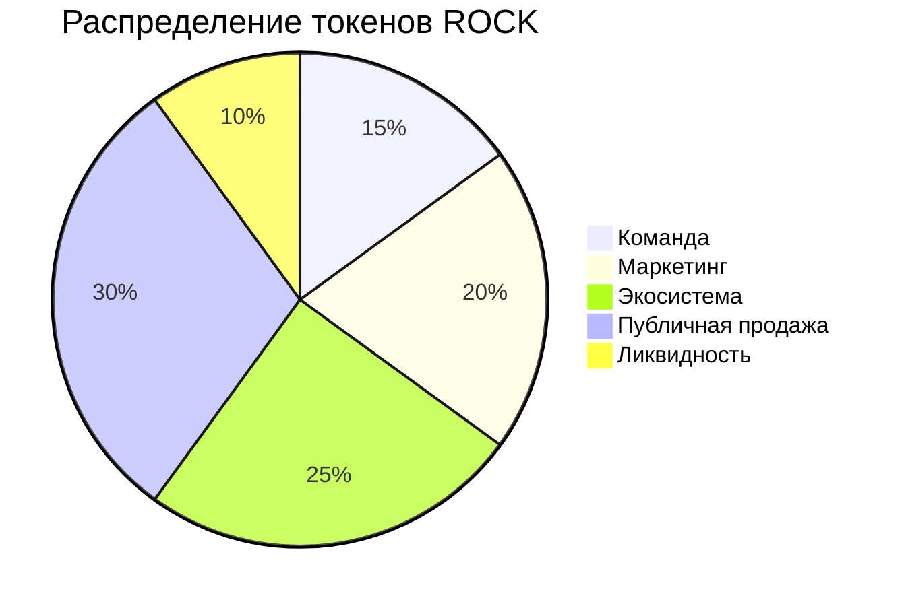

# 🎸 RockCOIN (ROCK)

Революционная криптовалюта для рок-музыки и музыкальной индустрии

## 📊 Статистика и графики

### График изменения цены RockCOIN
```mermaid
%%{init: {'theme': 'dark'}}%%
xychart-beta
    title "Динамика цены RockCOIN (ROCK)"
    x-axis [Янв, Фев, Март, Апр, Май]
    y-axis "Цена (USD)" 10 --> 15
    line [10, 11.2, 12.5, 13.1, 14.2] "ROCK"
```

### График продаж битов
```mermaid
%%{init: {'theme': 'dark'}}%%
xychart-beta
    title "Объем продаж битов"
    x-axis [Янв, Фев, Март, Апр, Май]
    y-axis "Количество" 1000 --> 5000
    line [1000, 2200, 3100, 4200, 5000] "Биты"
```

## 💎 Ключевые показатели

| Показатель | Значение |
|------------|----------|
| Общее предложение | 100M ROCK |
| Активных пользователей | 10K+ |
| Проданных битов | 50K+ |
| Текущая цена | $12.50 |
| Изменение (24ч) | +15.2% |

## 📈 Токеномика



## 💫 О проекте

RockCOIN (ROCK) — революционная криптовалюта, созданная для поддержки и развития рок-музыки. 
Наша миссия — создать децентрализованную экосистему, где музыканты и фанаты могут взаимодействовать напрямую.

## 🔒 Технические характеристики

- Тип токена: ERC-20
- Блокчейн: Ethereum
- Механизм консенсуса: Proof of Stake (PoS)
- Годовая доходность стейкинга: до 12% APY

## 🤝 Сообщество

Присоединяйтесь к нам в [Telegram](https://t.me/rockcoin123)

---

© 2023 RockCOIN. All rights reserved. 🎸
