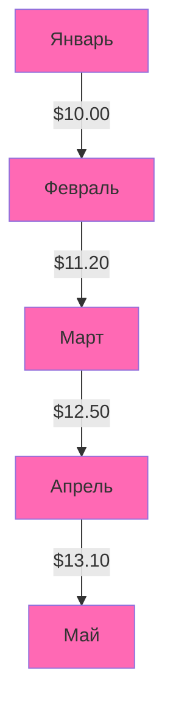
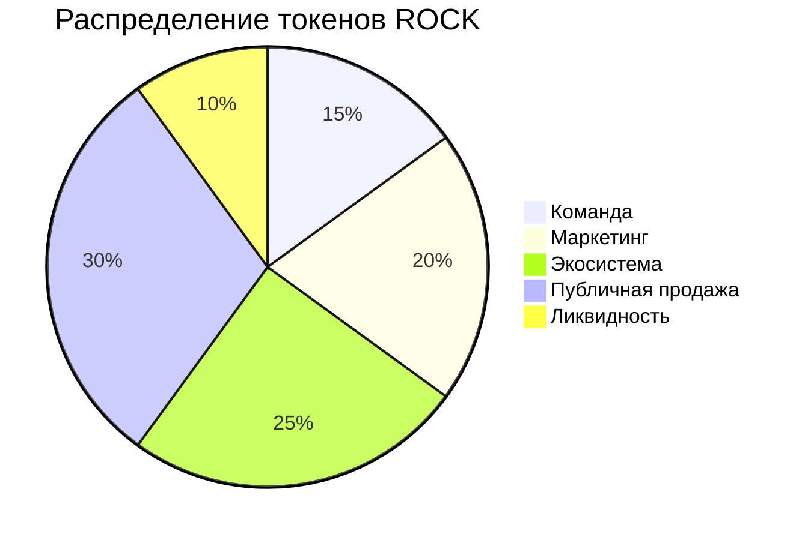

# 🎸 RockCOIN (ROCK)

Революционная криптовалюта для рок-музыки и музыкальной индустрии

## 📊 Статистика и графики

### Динамика цены RockCOIN

### Объем продаж битов

```mermaid
graph TD
    A[Январь] -->|"1000"| B[Февраль]
    B -->|"2200"| C[Март]
    C -->|"3100"| D[Апрель]
    D -->|"4200"| E[Май]
    style A fill:#262730
    style B fill:#262730
    style C fill:#262730
    style D fill:#262730
    style E fill:#262730
```

## 💎 Ключевые показатели

| Показатель | Значение |
|------------|----------|
| Общее предложение | 100M ROCK |
| Активных пользователей | 10K+ |
| Проданных битов | 50K+ |
| Текущая цена | $12.50 |
| Изменение (24ч) | +15.2% |

## 📈 Токеномика

## 💫 О проекте

RockCOIN (ROCK) — революционная криптовалюта, созданная для поддержки и развития рок-музыки. 
Наша миссия — создать децентрализованную экосистему, где музыканты и фанаты могут взаимодействовать напрямую.

## 🔒 Технические характеристики

- Тип токена: ERC-20
- Блокчейн: Ethereum
- Механизм консенсуса: Proof of Stake (PoS)
- Годовая доходность стейкинга: до 12% APY

## 🤝 Сообщество

Присоединяйтесь к нам в [Telegram](https://t.me/rockcoin123)

---

© 2023 RockCOIN. All rights reserved. 🎸
